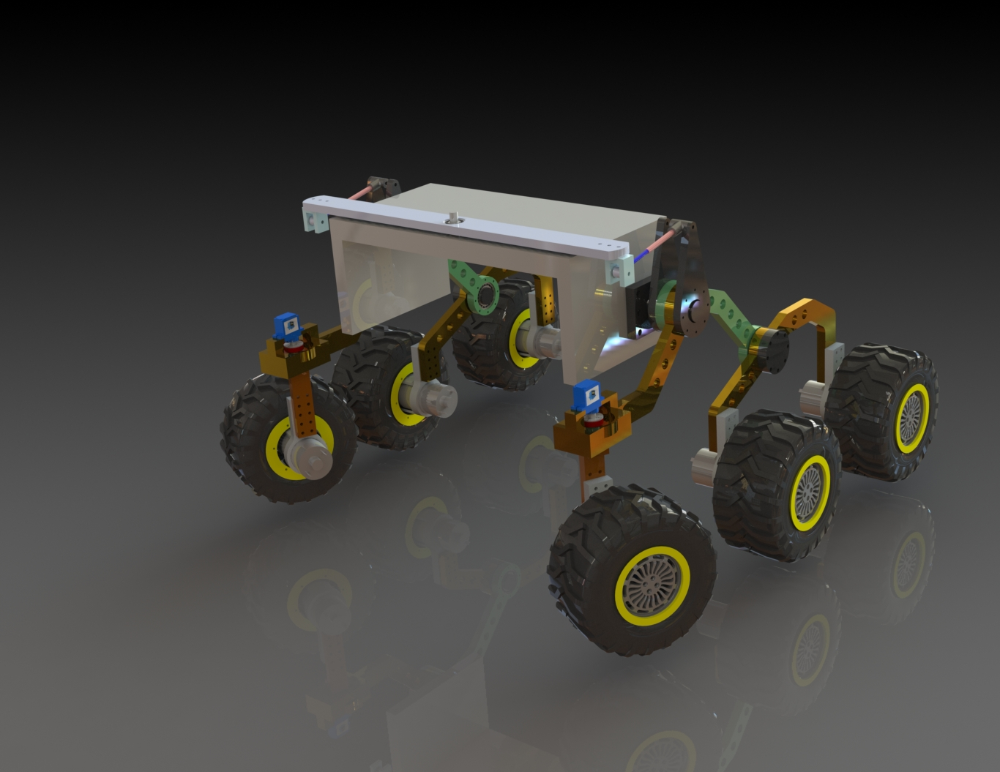

# Agro Gaurd 
## Introduction
A solar powered crop monitoring robot to used for monitoring crop pest and diseases commonly found in kenyan farms.
This is a suitable solution since:
1. Uses clean and renewable energy
2. Has low operation costs
3. Farmers can get real-time data and insights
4. Can lead to improved farm productivity.

## Targets for the solution:
1. Medium-scale farmers
2. Large-scale farmers
3. Farming co-operatives 
4. Individuals intending to start business ventures

## Modules incorporated in the robot:
1. Mechanical design and fabrication
2. Electronics design and simulation
3. Low-level programming (embedded systems and IoT)
4.  High-level programming (Machine learning and dashboard design)

